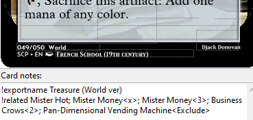

# MSE to Cockatrice database v4 exporter

An exporter from Magic Set Editor to Cockatrice. This exporter was made to work with the Cajun templates, but should work with any template with similar enough functionality.

Written by Normal Dream (Djack Donovan)

Based on Zeu's "CS/ECH exporter", itself based on Cajun’s “Updated Full Exporter”.

This README file is better read on Github: https://tinyurl.com/csexporterV4


<!-- TABLE OF CONTENTS -->
## Table of Contents
<ol>
  <li><a href="#features">Features</a></li>
  <li><a href="#how-to-use-in-cockatrice">How to use in Cockatrice</a></li>
  <li><a href="#options">Options</a></li>
  <li>
    <a href="#commands">Commands</a>
    <ul>
      <li><a href="#exportname">Exportname</a></li>
      <li><a href="#related">Related</a></li>
      <li><a href="#tapped">Tapped</a></li>
    </ul>
  </li>
  <li><a href="#troubleshooting">Troubleshooting</a></li>
</ol>


<!-- FEATURES -->
## Features

* Exports an XML file and associated image files which together allow people to play with your custom set in Cockatrice.
  * The set code associated with your set in Cockatrice will be the same as the set code in your MSE settings tab.
  * This also goes for the masterpiece set code if your set has any.
* Provides a suite of options to customize the output of the XML file and the image files.
* Provides a set of commands which allow you to customize the output of your files on a per-card basis.
* DFCs and split card images are automatically split / rotated as necessary.


<!-- HOW TO USE IN COCKATRICE -->
## How to use in Cockatrice
To use images, make a new folder in Cockatrice\pics\CUSTOM (name it your set code) and place you card images in it
 
To use with other cards, simply place the new .xml file in the customsets folder (Cockatrice\customsets)
then restart cockatrice


<!-- OPTIONS -->
## Options

| Option Name                      | Description                                                      |
|----------------------------------|------------------------------------------------------------------|
| Cockatrice Set Type              | What will appear in the “set type” column for your set in the Manage Sets window in Cockatrice. I encourage you to use “Custom” if you have no other specific one to use. |
| Export Images                    | Whether or not to export images along with the XML. Disable if you already have the images you want to use, or are testing variations of different XML settings and want the export process to go faster. |
| Images File Type                 | Which file type you want the images exported as. JPG are smaller and therefore easier to download, but lower quality. PNG are larger and therefore harder to download, but higher quality. JPG is recommended for images used in Cockatrice because the quality difference is hard to notice at card size during gameplay. |
| Write Tokens                     | In which file do you want the tokens to be written, if any. You shouldn't need to write them in a separate file , but is included in the case that legacy behaviour is needed. |
| Images URL                       | An url in which Cockatrice will try to load the card images from. If you upload your card images online, players will only need to download your set's XML and won't need to download anything else. (e.g. If you host the files on "w<span>ww.</span>host-website.com/folder/card-name.jpg", put "w<span>ww.</span>host-website.com/folder".)
| Append Set Code To Tokens        | Whether you’d like to put your set code in front of all your token names. This can be a replacement for using the Exportname command (described below) to do the same. |
| Append String To Names           | Fill in with a string that you’d like to append to the front of every one of your card names. This is useful if you are creating versions of cards which have the same name as other cards but which are actually different in some way, e.g. for a custom format which includes redesigns of canon cards, keeping those canon names. |


<!-- COMMANDS -->
## Commands



Commands are pieces of text placed into the card notes section of a card in MSE which signal to the exporter to perform some behavior for that card.

### Exportname
```
!exportname [name]
```

Use this command in the notes section to make Cockatrice use a different name for the card than what is rendered on the card. Replace "\[name\]" with the name that you want used.

Common use cases include:
* Renaming basic lands to allow players easier selection between them.
  * E.g. "!exportname JAN Mountain".
* Renaming tokens to avoid bugs caused by overlap with the names of other/official tokens.
  * E.g. "!exportname NET Soldier"

For DFC cards, the format should be “!exportname \[front face name\] // \[back face name\]”


### Related

```
!related [name1];[name2];[name3]<[param]>;........;
```

Use this command in the notes section of any token card to link that token with the cards that create that token.
This will allow players to create them more easily in Cockatrice. List the names of each card that produces the token.
* You can also include "\<N\>" directly after each name to specify how many tokens are made (brackets not optional). N can be a number like 1 or 4, it can be "x" which gives the player the option to produce any amount they want or it can be"x=3" to have x show a default value of 3. You may list a card name twice with different values for N to give the player multiple options.
* You can also include "\<Attached\>" to have the token come directly attached to the named card. Useful for equipment that create attached tokens (e.g. Batterskull) or for reminder card tokens like the Morph reminder token.
* You can also include "\<Exclude\>" if you don't want this token to be created when the player uses the "Create All Related Tokens" action.
* For double face cards, write the name of the face (e.g. "Child of the Pack"). For single sided cards with multiple spells, write the full name (e.g. "Alive // Well").


### Tapped
```
!tapped
```

This command is kept from the old exporter, but is no longer needed for cards with “~ enters the battlefield tapped” in their text.

Use this command in the notes section of any card to specify that a card comes into play tapped. This only applies when a card is “played” (double clicked in the hand) not when dragged directly onto the field.

<!-- TROUBLESHOOTING -->
## Troubleshooting

1. My token associations aren’t working.

Check your syntax, it’s very specific. Look at the example in the related section above to make sure. Also, check for typos and to make sure you haven’t renamed the card at some point. If your token’s name is one that overlaps with an official token (“Soldier”, “Treasure”) make sure to use !exportname, “append Set Code To Tokens” or “append String To Names” to differentiate it, this will solve some association problems.

2. The files work for me but they don't for the other people.

Double check to make sure they installed them correctly. Also check to see if all the image file names weren’t changed in the download process. Google Drive is known to modify punctuation improperly if you rely on its inbuilt zipping functionality for downloads. If that seems to be an issue, zip up your files before uploading to Google Drive.
