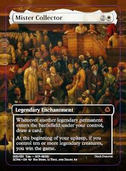
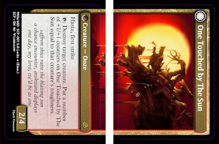
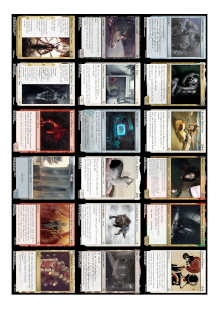
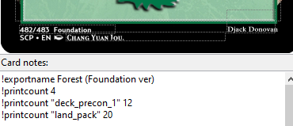

# Print Sheet exporter

Prints convenient card sheets at various size or for use with [makeplayingcards.com](https://www.makeplayingcards.com/). This exporter was made to work with the Cajun templates, it might need some changes if you use custom templates.

Written by Normal Dream (Djack Donovan)

This README file is better read on Github: https://tinyurl.com/csexporterV4


<!-- TABLE OF CONTENTS -->
## Table of Contents
<ol>
  <li><a href="#features">Features</a></li>
  <li><a href="#options">Options</a></li>
  <li>
    <a href="#commands">Commands</a>
    <ul>
      <li><a href="#print-count">Print Count</a></li>
      <li><a href="#exportname">Exportname</a></li>
      <li><a href="#fullart">Fullart</a></li>
    </ul>
  </li>
  <li>
    <a href="#make-playing-cardscom-guide">Make Playing Cards.com Guide</a>
    <ul>
      <li><a href="#exporting-the-cards">Exporting the cards</a></li>
      <li><a href="#ordering-the-cards">Ordering the cards</a></li>
    </ul>
  </li>
</ol>


<!-- FEATURES -->
## Features

* Print cards into convenient sheets of various paper sizes.
* Print card at a higher resolutions that the default MSE export option allows, keeping text sharp.
* Square off card corners and add margins (for better result with makeplayingcards.com or other kind of printing).
  * Fullart card margins are extended in a discreet way.
* Split the front and back sides of DFCs and Meld cards.
  * Correctly split the top and bottom part Meld cards.
* Handle custom print list to easily print a whole deck rather than selecting each card individually.


||||
| :---------------------------------------------------------: | :--------------------------------------------------: | :-----------------------------------------: |
| Fullart card with bleed                                     | Meld card back split into two, also with bleed       | Card sheet                                  |
  

<!-- OPTIONS -->
## Options

| Option Name                      | Description                                                      |
|----------------------------------|------------------------------------------------------------------|
| Format                           | On what paper format do you want to print your cards? Or do you want to print them individually, or just print the card list in the txt file. |
| Bleed Mode                       | Should the card corners be squared off? Should bleed be added?   |
| Zoom Level                       | How much the resolution of cards should be increased. Higher zoom means higher resolution, but longer computing time. This only effect text and symbols resolution, art and frame resolutions are fixed. <br/> *Note:* A0 sheets are limited to 1x, A1 to 2x, and A2 to 3x. This is a technical limitation and might be different on other computers. |
| Add Full Page Margin             | Add a margin to the sheet to make the image fill the whole page. |
| Add Cut Lines                    | Add guide lines to help when manually cutting the cards.         |
| Print Count                      | How many card of each should be printed by default. (see the !printcount command) |
| Print Group                      | Which print group should be taken into account. (see the !printcount command) |
| DFC Front and Back in separate folders | If set to Yes, DFC cards will be written in a two folders, otherwise those folders will be combined into one. |
| Write                            | Which card rarities do you want to print?                        |


<!-- COMMANDS -->
## Commands



Commands are pieces of text placed into the card notes section of a card in MSE which signal to the exporter to perform some behavior for that card.

### Print Count

```
!printcount [amount]
```
or
```
!printcount "[group name]" [amount]
```

Use this command to indicate that you want to print a different amount of this card than the one indicated by the "Print Count" option. For example if by default, you want 10 of each basic lands to be printed instead of the same amount as your other cards.

The "Print Group" option allows you to define multiple sets of cards, for example if you have multiple deck lists. If no "Print Group" is specified in the export options, the basic `!printcount [amount]` will be used. Otherwise the corresponding `!printcount "[group name]" [amount]` will be used. This means that if you want to Only print your decklist, you also need to set the "Print Count" option to 0.

### Exportname
```
!exportname [name]
```

Use this command in the notes section to make card files use a different name than the one rendered on the card. Replace "\[name\]" with the name that you want used.

This mostly exists to stay consistent with the Cockatrice exporter.

### Fullart

```
!fullart
```

If you use a fullart template that isn't recognised by the exporter, you can use this command to indicate to the exporter that it should add bleed to the card as if it was fullart. This shouldn't ever be needed if you use the Cajun templates.


<!-- MAKE PLAYING CARDS.COM GUIDE -->
## Make Playing Cards.com Guide

### Exporting the cards

Use these export options:

| Option          | Value                           |
|-----------------|---------------------------------|
| "Format"        | "Individual Cards"              |
| "Bleed Mode"    | "Add bleed"                     |
| "Zoom"          | "x4" (This will make export time a lot longer, you may want to drop it to 1x if you're just doing some quick tests.) |
| "Add cut lines" | No                              |
| "DFC Front and Back in separate folders" | Yes (This will help you if you follow the guide bellow to order the cards.) |

Note: If you want to print more than 5 of each cards, you may consider a "Print Count" of 1, MPG will allow you to print multiple decks for cheaper.

### Ordering the cards

This guide was copied from a [reddit post](https://www.reddit.com/r/magicproxies/comments/q7309m/make_playing_cards_tutorial/) by [u/MrTeferi](https://www.reddit.com/user/MrTeferi/) and kept here for posterity.

Ordering from [makeplayingcards.com](https://www.makeplayingcards.com/):

* Begin your order here: http://www.makeplayingcards.com/design/custom-blank-card.html

* Card stock: S30 or S33 (some people prefer S33 for its thickness), Size of Deck: Choose the best option for the amount of cards you're printing, Print type: Full color print (Holographic front for foils), Finish: MPC card finish, Packaging: Shrink-wrapped is fine, Booklets: None

* Hit "Start your design". The next page will ask whether you would like all the cards to look the same or different. In most cases you'll just want to click "Different", if you want some duplicates you can still add the same image repeatedly if you choose.

* For uploading my card images, I like to make a "Buy" folder on my desktop, inside that folder I'll have images of every card I want a SINGLE copy of, and I'll make a second folder inside that folder named "2" for cards I want 2 copies of, "3" for cards I want 3 copies, etc. I also like to make one last folder for any double faced cards, noting which cards go together using numbers, ex: "1. Branchloft Pathway + 1. Boulderloft Pathway"

* Upload the singles first, this might take awhile. Once those are all uploaded click "Help me autofill images". The site will fill the singles into spots for your order. Next you'll want to upload images from the "2" folder, once they are uploaded just drag and drop those images manually into 2 slots per image. Repeat this step for copies of 3, 4, etc.
  * Exporter Note: If you used a higher "Print Count" option, you will have multiple images for each card. This means that upload will take longer, but also that you won't have to do anything to handle cards with multiple copies.

* At the very end upload the FRONT FACE of your double faced cards and place them, noting which image number each one is placed. Since they are at the very end of the list their placement should be relatively easy to keep track of.

* Hit next step. This will take you to a page where you can add text. If you don't want to add any text, just hit next step again to continue to the back side of the card. If you don't have any double faced cards, you can just choose the same image for all backs, upload your back and place it.

* If you do have some double faced cards, or want to use basic lands as your backs for example, you can choose different backs for all images. Upload the appropriate images and place them as intended, remember to place the backs of the double face cards in the spots you noted before.

* Hit next step. This will take you to another page where you can add text. If you don't want to add any text, just hit next step again to continue to checkout. You should be able to figure it out from there.
